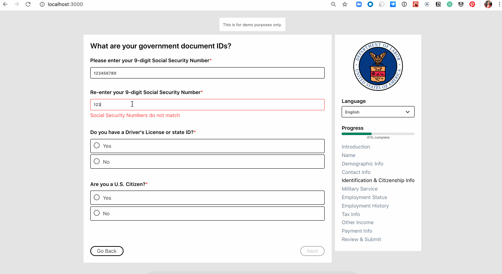
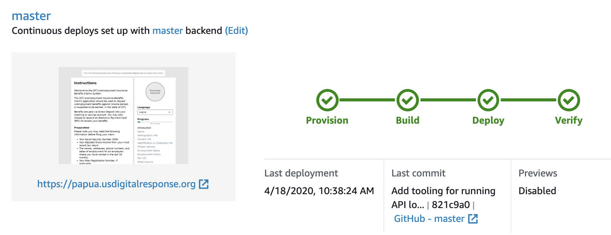
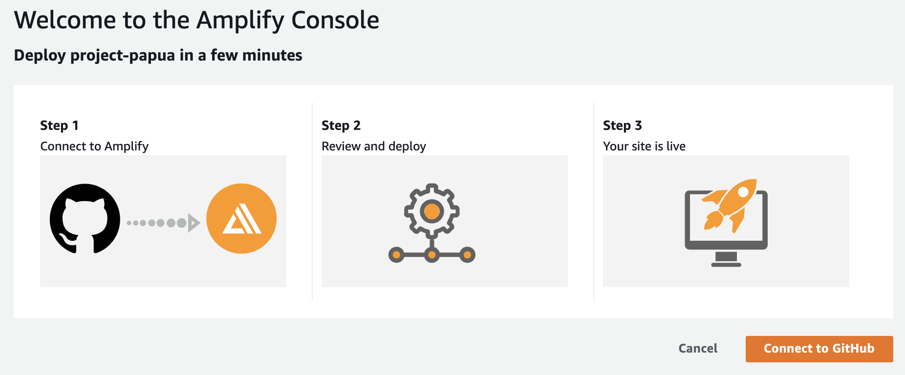

# Project PAPUA

The Pilot Application for Pandemic Unemployment Assistance (PAPUA) project is a prototype service providing a unified unemployment intake form and delivers validated unemployment claims to various State backends. This project is a volunteer-led effort and part of the [US Digital Response network.][1]

Give it a spin at https://papua.usdigitalresponse.org, or deploy it to your own AWS account in under 5 mins [with one click.](#deploying)


## Features

- Generates a custom form from a yaml config doc provided by the state.
- Validated form data is stored in S3 as json.
- A transform function converts the json to csv and re-uploads, in batches.
- The state writes a script to load the converted s3 into whatever environment they need.
- Minimal deployment overhead
- intellisense for form.yml fields makes editing a breeze

# Technical overview

PAPUA is built and hosted with AWS Amplify, which automates CICD handily and also generates a bunch of Cloudformation templates for things like REST APIs, storage S3 buckets, SSL etc. It isn’t perfect, but it makes up for its shortcomings in reduced dev time to get a prototype into a State's environment so you can then start customizing to the client’s specific needs.
Components:

- [Amplify for hosting, CICD][2]
- [S3 for storage][3]
- [Lambda for compute][4]

[Check out the System Design Doc here.][5]



# Running locally

To run the app locally, just do the following:

```bash
# Install dependencies:
$ yarn
# Boot the app. It'll auto-reload as you make changes to
# the front-end source code.s
$ yarn start
```

If you want to test the submission process with the API, you'll need to also:

```bash
# Boot a local S3 setup
$ docker-compose up -d
# [one-time] Create the S3 bucket locally that the API depends on:
$ aws s3 --endpoint-url='http://localhost:4572' mb s3://papua-data-123456789
# Boot the API server. It'll auto-reload as you make changes to
# the backend TS source code.
$ yarn backend
```

You can inspect the contents of the S3 bucket like so:

```bash
# List buckets:
$ aws s3 --endpoint-url=http://localhost:4572 ls
# List top-level files in the bucket:
$ aws s3 --endpoint-url=http://localhost:4572 ls s3://papua-data-123456789/
# View which days claims have been submitted on:
$ aws s3 --endpoint-url=http://localhost:4572 ls s3://papua-data-123456789/claims/
# ... etc.
# Open a claim from the local S3:
aws s3 --endpoint-url=http://localhost:4572 cp s3://papua-data-123456789/claims/day=2020-04-18/hour=16/3.json - | jq .
```

# Deploying
You can deploy the complete PAPUA service with AWS Amplify, or deploy the front-end form with Github Pages.  

## Deploying with AWS Amplify
Requirements:

- GitHub account
- AWS account

Note: this process will fork this repo into your GitHub account, as well as create real AWS resources. Take a moment to review your AWS account's security settings, and remember to tear down this project when you're done using it.


To deploy PAPUA for your state:

1. Click the following button to deploy to your state's AWS account:

[](https://console.aws.amazon.com/amplify/home#/deploy?repo=https://github.com/usdigitalresponse/project-papua)

Your fork is now configured to auto-deploy the `master` branch to your Amplify deployment.

2. [Optional] Update the questions used in your state's PAPUA form by editing `forms.yml` and committing those changes to the `master` branch of your fork.

3. [Optional] Update the state logo by dropping a `<state code>.png` file into `public` and committing that change to the `master` branch of your fork.

4. [Optional] By default, this system will produce an hourly CSV of claim submissions. If you want to customize this, you can implement a "transformer" which will write claims in batches into your state's system. You can do this by adding a file to `backend/functions/transformer/src/transformers/<state code>.ts` where `<state code>` is your state's two-letter state abbreviation (CA, OR, etc.).

Inside that file, implement a function like so:

```ts
// backend/functions/transformer/src/transformers/<state code>.ts
import { Transformer } from './index'

// Name this function the same name as your state code.
//
// cfg includes the hour/day of this run.
// claims includes an array of all JSON claims uploaded in the previous hour.
export const ca: Transformer = async (cfg, claims) => {
  // TODO(you): write `claims` into your system.

  return {}
}
```

You can this commit this file to the `master` branch in your fork, which will update your deployment on Amplify. To switch the backend transformer from the default (`csv`) to your state's (`<state code>`) just update the `STATE_CODE` environment variable.

At this point, you can now reboot your Lambda to pick up this environment change by clicking on your backend environment and selecting `Redeploy this version`.

5. [Optional] Redirect a subdomain from your state's website to this Amplify app. [Docs][6]

## Deploying with Github Pages
With this method, you'll be able to quickly get your form hosted without having to configure AWS infrastructure or custom backend components. This method is great for standing up a self-guided qualifaction wizard, or if you want to use PAPUA templating with a non-AWS backend.

Requirements:

- GitHub account

1. Fork this repo
2. Update the `predeploy` script found in `package.json` to `https://<username>.github.io/<repository>/`
3. [Optional] Update the questions used in your state's PAPUA form by editing `forms.yml` and committing those changes to the `master` branch of your fork.
4. [Optional] Update the state logo by dropping a `<state code>.png` file into `public` and committing that change to the `master` branch of your fork.
5. [Optional] Update the API call. By default, PAPUA make a post request to an AWS endpoint, this will break with non-Amplify deployments.

Remove or change the below code block to match your needs. (You can also remove the submit button altogether)

```ts
// src/components/FormApp.tsx
const resp = await API.post('resolverAPI', '/claims', {
  body: {
    metadata: {
      uuid: uuid(window.location.hostname, uuid.DNS),
      timestamp: new Date(),
      host: window.location.hostname,
    },
    questions: values,
  },
}). 
```
6. [Optional] Configure a custom domain on github.com, found under Settings in your fork. [See the docs.][7] 
7. To deploy:
```bash
yarn install
yarn predeploy
yarn deploy
```

Your form is now hosted at `https://<username>.github.io/<repository>/`


# Contributing

See [CONTRIBUTING.md](CONTRIBUTING.md) for additional information.

If you are editing a form ([`public/form.yml`](public/form.yml)), then consider using [VSCode][8] with the [YAML extension][9]. With this, you'll get syntax validation and intellisense while editing the form.

# License

[Apache 2.0](LICENSE)

[1]: https://www.usdigitalresponse.org/
[2]: https://aws.amazon.com/amplify/
[3]: https://docs.aws.amazon.com/AmazonS3/latest/dev/Welcome.html
[4]: https://aws.amazon.com/lambda/
[5]: https://docs.google.com/document/d/1Jntt7jOtc_5Qj4SP7GdC4u3Uyg9z_kU6jsm3CpCaeWU/edit?usp=sharing
[6]: https://docs.aws.amazon.com/amplify/latest/userguide/custom-domains.html
[7]: https://help.github.com/en/github/working-with-github-pages/managing-a-custom-domain-for-your-github-pages-site
[8]: https://code.visualstudio.com/
[9]: https://marketplace.visualstudio.com/items?itemName=redhat.vscode-yaml
